# Credit Scoring Model

This project develops a **Credit Scoring Model** using various machine learning techniques, including Exploratory Data Analysis (EDA), data preprocessing, and an Artificial Neural Network (ANN). The goal is to predict the credit score of individuals based on their financial behavior and other attributes. 

## Table of Contents
1. [Overview](#overview)
2. [Project Setup](#project-setup)
3. [Data](#data)
4. [Modeling](#modeling)
5. [Results](#results)
6. [Usage](#usage)
7. [Contributing](#contributing)
8. [License](#license)
9. [Acknowledgments](#acknowledgments)

## Overview
The **Credit Scoring Model** predicts credit scores based on key factors such as:
- Monthly salary
- Loan amount
- Payment behavior
- Credit card utilization

The model uses an Artificial Neural Network (ANN) to classify the credit score into one of the following categories:
- Good
- Standard
- Poor

### Link to the repository: [GitHub Repository](https://github.com/AryanMithbawkar/Credit-Scoring-Model)

## Project Setup

### Requirements

- Python 3.7 or higher
- TensorFlow
- Scikit-learn
- Pandas
- Numpy
- Matplotlib
- Seaborn
- Gradio (for UI interface)

To install the required libraries, run:

```bash
pip install -r requirements.txt
```
## Folder Structure
```bash
.
├── dataset.csv
├── credit-score-classification-eda-and-ann-model.ipynb
├── README.md
├── output1.png
├── output2.png
└── ...
```
## Data
The dataset used for this project consists of financial behavior information such as annual income, number of bank accounts, delayed payments, outstanding debt, and monthly balances.
+ Key features:
  -Age	
  - Occupation	
  - Annual_Income
  - Monthly_Inhand_Salary
  - Num_Bank_Accounts
  - Num_Credit_Card
  - Interest_Rate
  - Num_of_Loan
  - Delay_from_due_date
  - Num_of_Delayed_Payment
  - Changed_Credit_Limit
  - Num_Credit_Inquiries
  - Credit_Mix
  - Outstanding_Debt
  - Credit_Utilization_Ratio
  - Payment_of_Min_Amount
  - Total_EMI_per_month
  - Amount_invested_monthly
  - Payment_Behaviour
  - Monthly_Balance
  - Credit_History_Age_Months
  - Credit_Score (Target variable)
## Data Preprocessing
+ **Missing Value Handling**: Missing values in columns like Monthly_Inhand_Salary and Type_of_Loan were filled using forward fill and mode values.
+ **Outlier Removal**: Outliers in key financial features such as Annual_Income and Num_of_Loan were removed to ensure better model performance.
+ **Feature Encoding**: Categorical features like Occupation and Payment_Behaviour were encoded using label encoding.
+ Example of EDA and Data Preprocessing:
  - Visualization of missing values:
    - 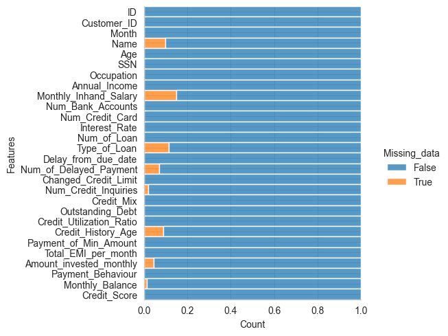
  - Distribution of customer occupations:
    - 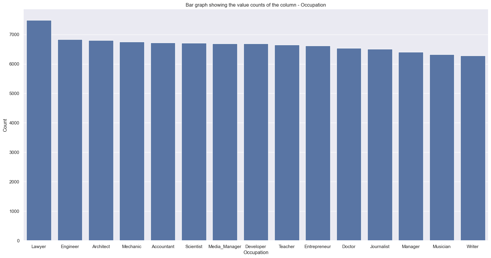
    - 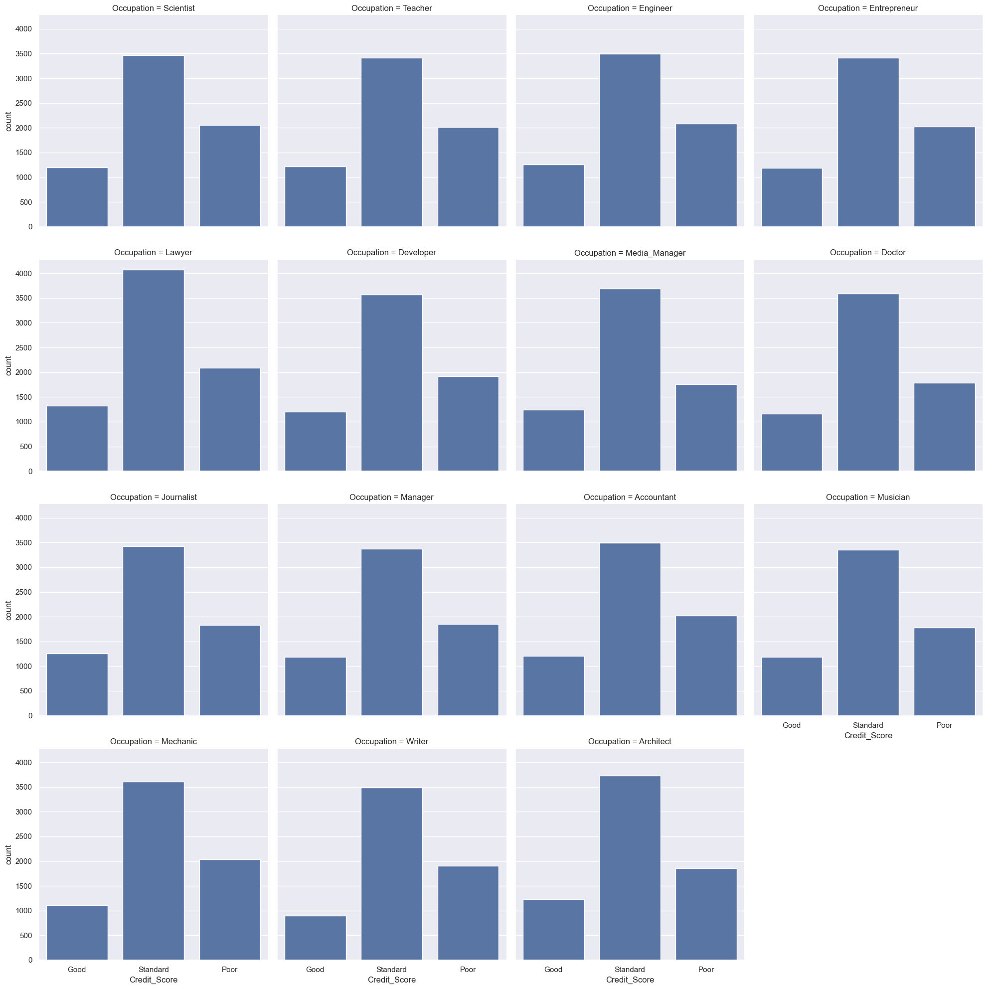
  - Relationship between Credit Score and Age:
    - 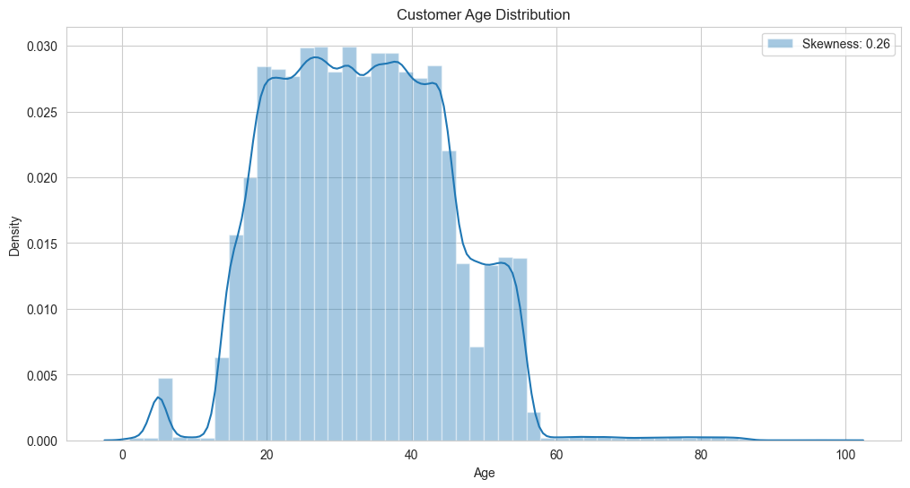
  - Other visualizations:
     - 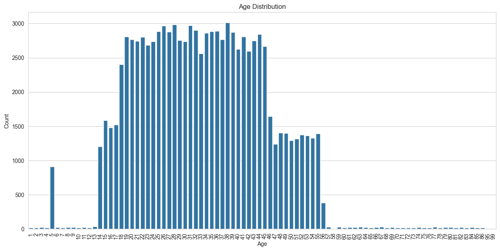
     - 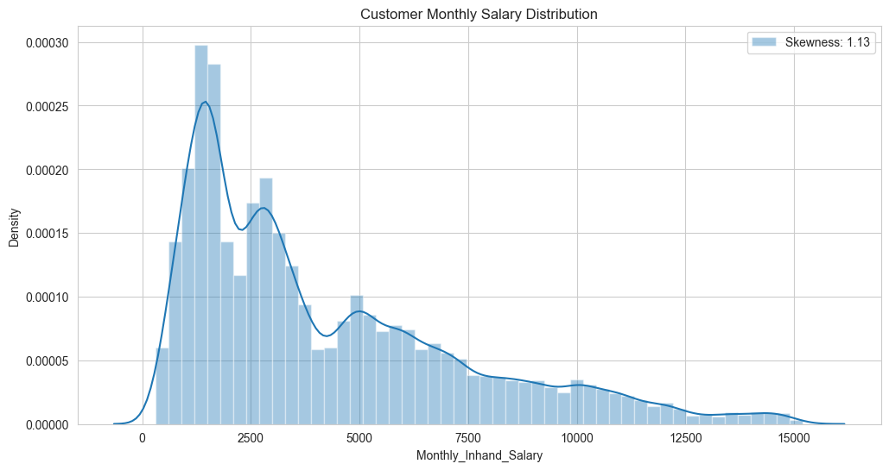
     - 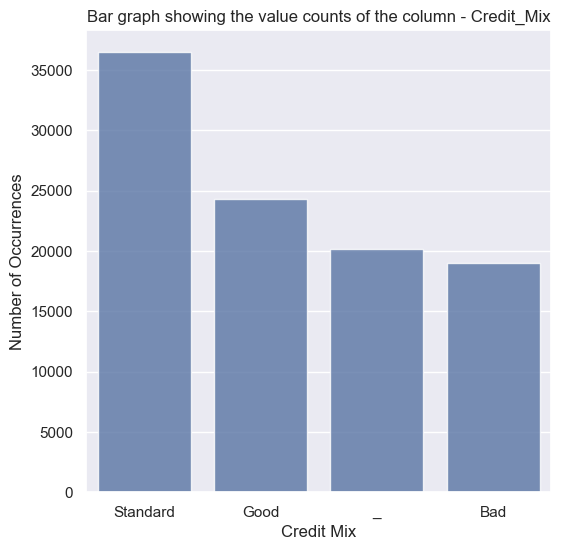
     - 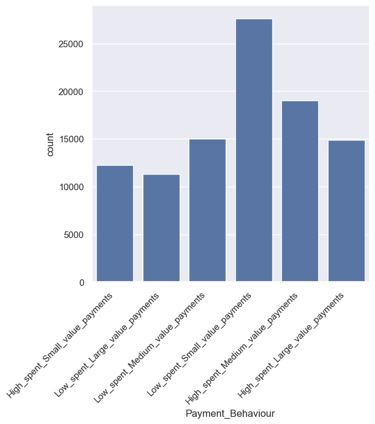
     - 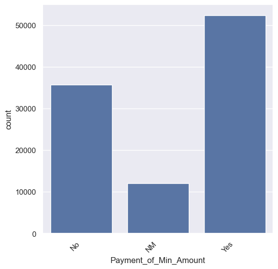
     - 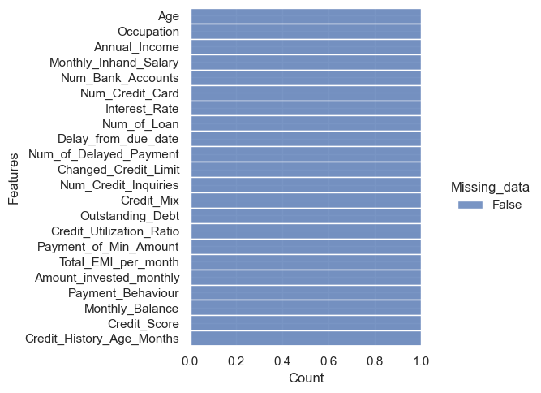
     - 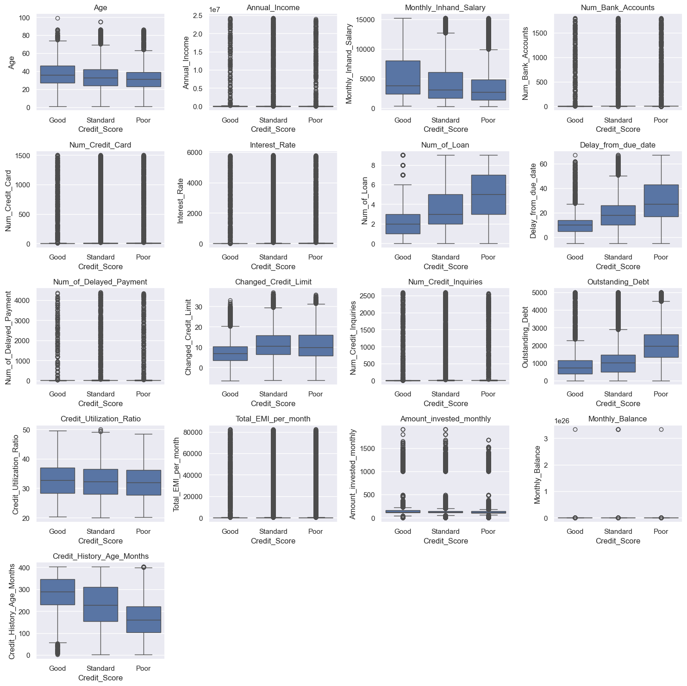
     - 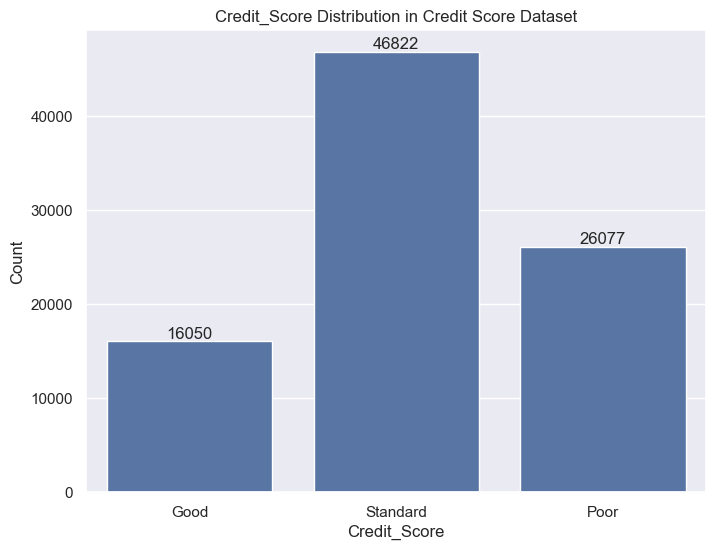
     - 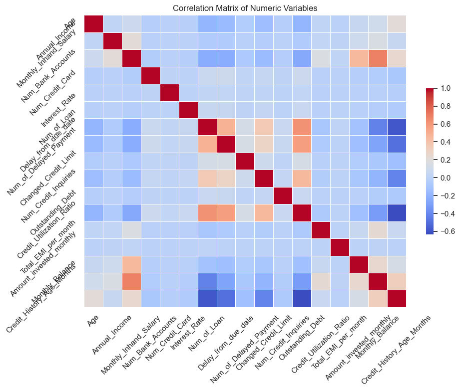
     - 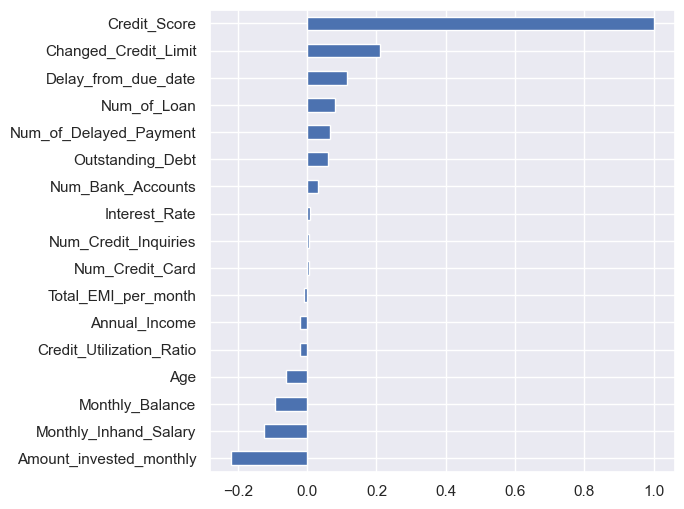

## Modeling
 The core of this project is an Artificial Neural Network (ANN), which is used to predict the credit score class.
## ANN Model Structure
+ Input Layer: 22 features
+ Hidden Layers: 6 layers with 512, 256, 128, 128, 128, and 64 units respectively, all using ReLU activation, with 6 dropout layes with 0.3 units and 6 batch nnormalization layers
+ Output Layer: 3 units using softmax activation for multi-class classification
 ```bash
model = Sequential([
 Dense(512, input_dim=X_train.shape[1], activation='relu'),
    BatchNormalization(),
    Dropout(0.3),
    Dense(256, activation='relu'),
    BatchNormalization(),
    Dropout(0.3),
    Dense(128, activation='relu'),
    BatchNormalization(),
    Dropout(0.2),
    Dense(128, activation='relu'),
    BatchNormalization(),
    Dropout(0.3),
    Dense(128, activation='relu'),
    BatchNormalization(),
    Dropout(0.3),
    Dense(64, activation='relu'),
    BatchNormalization(),
    Dropout(0.25),

    Dense(3, activation='softmax')
    ])
```
## Results and Performance
+ Accuracy: 86.5%
+ F1 Score: 82.3% (macro average)

## Results
Here are some sample results from the model predictions:

|Actual Credit Score	| Predicted Credit Score|
|-----------|-------------|
|Good |	Good|
|Standard |	Standard|
|Poor |	Poor|

## Usage
To use the model for predicting credit scores, follow these steps:

1. Clone the repository:
```bash
git clone https://github.com/AryanMithbawkar/Credit-Scoring-Model
```
2. Run the Jupyter Notebook:
```bash
jupyter notebook credit-score-classification-eda-and-ann-model.ipynb
```
3.  you can use the Gradio Interface for easy input and prediction:
```bash
import gradio as gr
interface = gr.Interface(
    fn=predict_credit_score,
    inputs=[
        gr.Number(label="Age"),
        gr.Dropdown(choices=['Lawyer', 'Mechanic', 'Architect', 'Engineer', 'Accountant',
                                    'Scientist', 'Developer', 'Teacher', 'Doctor', 'MediaManager', 
                                    'Journalist', 'Entrepreneur', 'Musician', 'Manager', 'Writer'], label="Occupation"),
        gr.Number(label="Annual Income"),
        gr.Number(label="Monthly Inhand Salary"),
        gr.Number(label="Num Bank Accounts"),
        gr.Number(label="Num Credit Card"),
        gr.Number(label="Interest Rate"),
        gr.Number(label="Num of Loan"),
        gr.Number(label="Delay from due date"),
        gr.Number(label="Num of Delayed Payment"),
        gr.Number(label="Changed Credit Limit"),
        gr.Number(label="Num Credit Inquiries"),
        gr.Dropdown(choices=['Bad', 'Good', 'Standard'], label="Credit Mix"),
        gr.Number(label="Outstanding Debt"),
        gr.Number(label="Credit Utilization Ratio"),
        gr.Dropdown(choices=['Yes', 'No', 'NM'], label="Payment of Min Amount"),
        gr.Number(label="Total EMI per month"),
        gr.Number(label="Amount invested monthly"),
        gr.Dropdown(choices=['Low_spent_Small_value_payments', 'Low_spent_Medium_value_payments',
                                    'Low_spent_Large_value_payments', 'High_spent_Small_value_payments',
                                    'High_spent_Medium_value_payments', 'High_spent_Large_value_payments'], 
                           label="Payment Behaviour"),
        gr.Number(label="Monthly Balance"),
        gr.Number(label="Credit History Age in Months")
    ],
    outputs="text",
    title="Credit Score Prediction",
    description="Enter customer details to predict their credit score class."
)

# Launch the Gradio interface
interface.launch()
```
interface output:
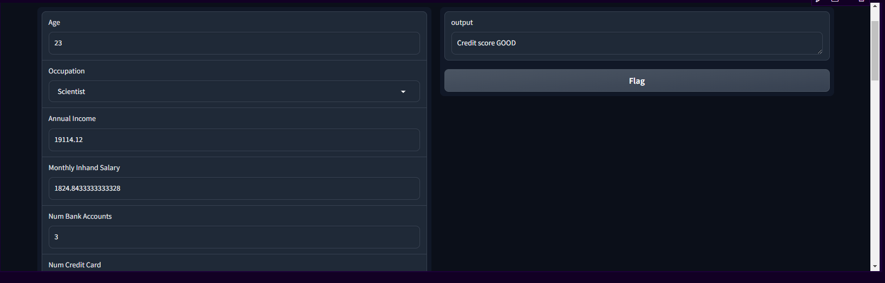

4. Predict the credit score by entering key details like annual income, number of delayed payments, etc.

## Contributing
We welcome contributions from the community. Feel free to raise issues or create pull requests to improve the project.

1. Fork the repository
2. Create a new branch for your changes
3. Commit your changes and create a pull request

## License
This project is licensed under the MIT License - see the LICENSE file for details.

## Acknowledgments
+ Special thanks to the TensorFlow and Scikit-learn communities for their open-source libraries.
+ Thanks to Kaggle for providing a vast source of datasets.
